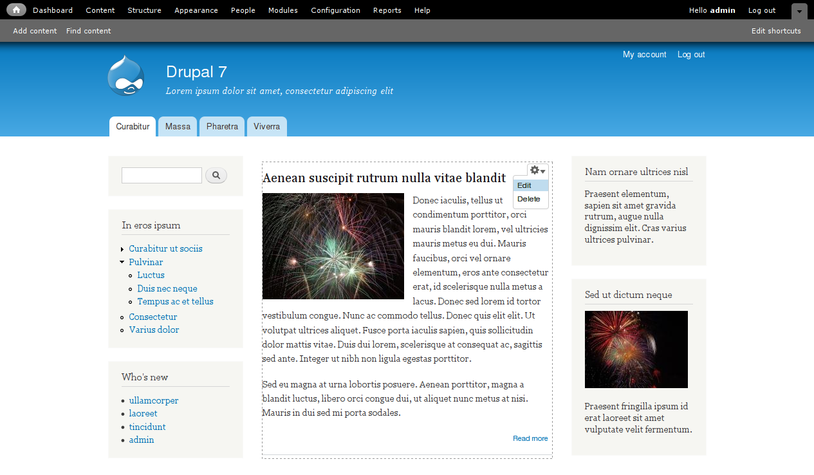

<!--
Ohart ongi: README hau automatikoki sortu da <https://github.com/YunoHost/apps/tree/master/tools/readme_generator>ri esker
EZ editatu eskuz.
-->

# Drupal 7 YunoHost-erako

[](https://dash.yunohost.org/appci/app/drupal7)  

[](https://install-app.yunohost.org/?app=drupal7)

*[Irakurri README hau beste hizkuntzatan.](./ALL_README.md)*

> *Pakete honek Drupal 7 YunoHost zerbitzari batean azkar eta zailtasunik gabe instalatzea ahalbidetzen dizu.*  
> *YunoHost ez baduzu, kontsultatu [gida](https://yunohost.org/install) nola instalatu ikasteko.*

## Aurreikuspena

Free and open-source content management framework.


**Paketatutako bertsioa:** 7.98~ynh3

## Pantaila-argazkiak



## Dokumentazioa eta baliabideak

- Aplikazioaren webgune ofiziala: <https://www.drupal.org>
- Erabiltzaileen dokumentazio ofiziala: <https://www.drupal.org/docs/7>
- Jatorrizko aplikazioaren kode-gordailua: <https://github.com/drupal/drupal>
- YunoHost Denda: <https://apps.yunohost.org/app/drupal7>
- Eman errore baten berri: <https://github.com/YunoHost-Apps/drupal7_ynh/issues>

## Garatzaileentzako informazioa

Bidali `pull request`a [`testing` abarrera](https://github.com/YunoHost-Apps/drupal7_ynh/tree/testing).

`testing` abarra probatzeko, ondorengoa egin:

```bash
sudo yunohost app install https://github.com/YunoHost-Apps/drupal7_ynh/tree/testing --debug
edo
sudo yunohost app upgrade drupal7 -u https://github.com/YunoHost-Apps/drupal7_ynh/tree/testing --debug
```

**Informazio gehiago aplikazioaren paketatzeari buruz:** <https://yunohost.org/packaging_apps>
