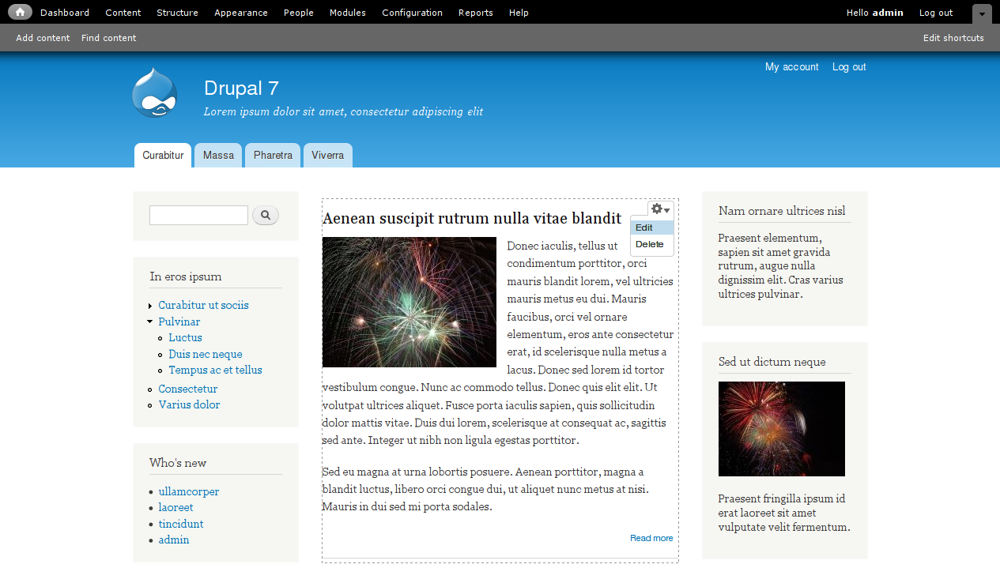

<!--
N.B.: README ini dibuat secara otomatis oleh <https://github.com/YunoHost/apps/tree/master/tools/readme_generator>
Ini TIDAK boleh diedit dengan tangan.
-->

# Drupal 7 untuk YunoHost

[](https://ci-apps.yunohost.org/ci/apps/drupal7/)


[](https://install-app.yunohost.org/?app=drupal7)

*[Baca README ini dengan bahasa yang lain.](./ALL_README.md)*

> *Paket ini memperbolehkan Anda untuk memasang Drupal 7 secara cepat dan mudah pada server YunoHost.*  
> *Bila Anda tidak mempunyai YunoHost, silakan berkonsultasi dengan [panduan](https://yunohost.org/install) untuk mempelajari bagaimana untuk memasangnya.*

## Ringkasan

Free and open-source content management framework.


**Versi terkirim:** 7.103~ynh1

## Tangkapan Layar



## Dokumentasi dan sumber daya

- Website aplikasi resmi: <https://www.drupal.org>
- Dokumentasi pengguna resmi: <https://www.drupal.org/docs/7>
- Depot kode aplikasi hulu: <https://github.com/drupal/drupal>
- Gudang YunoHost: <https://apps.yunohost.org/app/drupal7>
- Laporkan bug: <https://github.com/YunoHost-Apps/drupal7_ynh/issues>

## Info developer

Silakan kirim pull request ke [`testing` branch](https://github.com/YunoHost-Apps/drupal7_ynh/tree/testing).

Untuk mencoba branch `testing`, silakan dilanjutkan seperti:

```bash
sudo yunohost app install https://github.com/YunoHost-Apps/drupal7_ynh/tree/testing --debug
atau
sudo yunohost app upgrade drupal7 -u https://github.com/YunoHost-Apps/drupal7_ynh/tree/testing --debug
```

**Info lebih lanjut mengenai pemaketan aplikasi:** <https://yunohost.org/packaging_apps>
